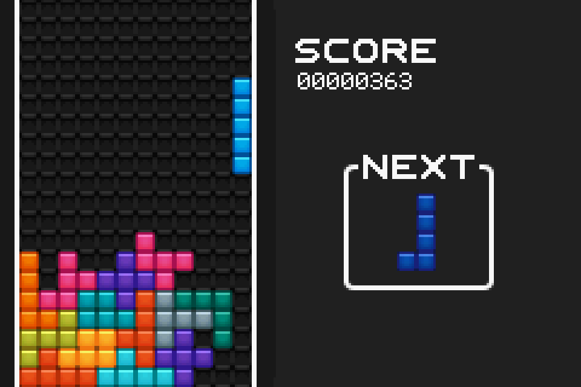

# Pentris


Pentris is a variation of tetris for the GameBoy Advance.
Instead of using tetriminos, Pentris uses [pentominoes](https://en.wikipedia.org/wiki/Pentomino).
You can play Pentris in a GBA emulator (like VisualBoy Advance), or on a physical GBA if you have a flash cartridge (like the [Everdrive GBA](https://krikzz.com/store/home/42-everdrive-gba-x5.html)).

This was originally a project for CS 2110 at Georgia Tech in the Spring 2016 semester.
The requirements were effectively "Make a non-trivial GBA game in display mode 3."
To my koweledge, this project is being phased out, and its requirements have changed pretty significantly throughout the history of the project.
What I'm saying is that you shouldn't copy any of the code in this repo for a similar assignment.

I would also strongly recommend not using this game's implementation for a general Tetris game, because the approach taken to represent tiles and perform rotations only works with pieces that have an odd number of tiles.
This game is also pretty power-inefficient since it waits for vblank with a loop instead of interrupts, which prevents the CPU from idling.

## Gameplay


**Controls**

| Button     | Action                   |
|:----------:|--------------------------|
| **⯇**      | Move piece left          |
| **⯈**      | Move piece right         |
| **⯆**      | Soft Drop                |
| **A**      | Hard Drop                |
| **L**      | Rotate counter-clockwise |
| **R**      | Rotate clockwise         |
| **Start**  | Reset game               |

## Project Setup
This project builds with the the `gba-dev` toolkit from DevKit Pro.
The following commands will install the toolchain on Ubuntu (and Windows Subystem for Linux). See
[The Getting Started Guide](https://devkitpro.org/wiki/Getting_Started) on DevKit Pro's website for other platforms.

```sh
wget https://github.com/devkitPro/pacman/releases/download/devkitpro-pacman-1.0.1/devkitpro-pacman.deb
sudo dpkg -i devkitpro-pacman.deb
sudo dkp-pacman -S gba-dev
```

You can then build the project with `make` in the root directory of this repo.
